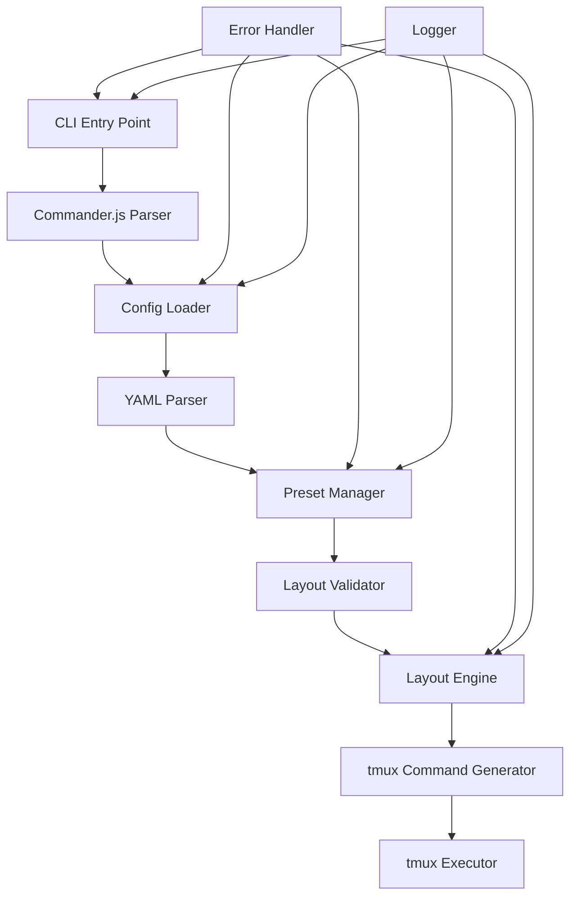
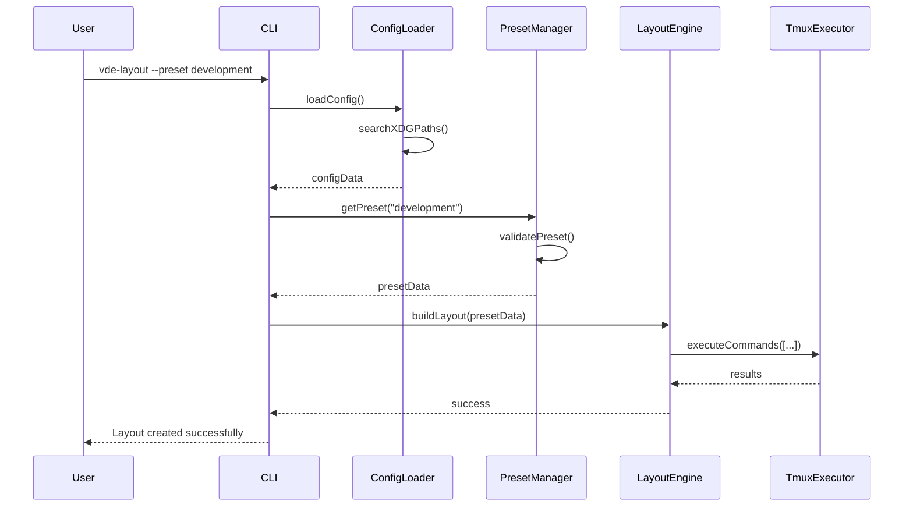
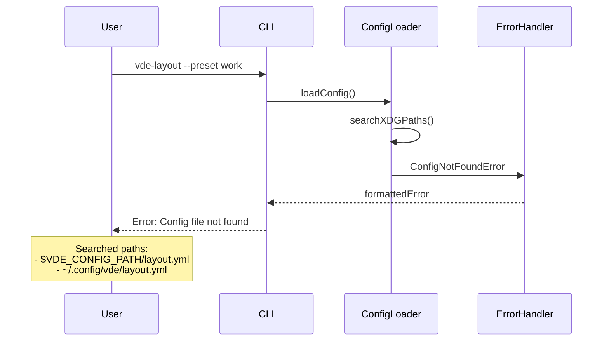
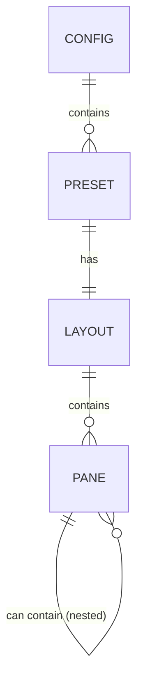
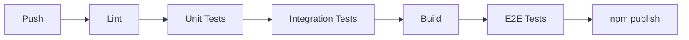

# 技術設計

## 概要

vde-layoutのプリセットローダー機能は、YAMLファイルで定義されたレイアウトプリセットを読み込み、tmuxのペイン構成を自動的に再現するCLIツールです。本設計では、要件ドキュメントで定義された6つの主要要件を満たすアーキテクチャとコンポーネント設計を提供します。

## 要件マッピング

### 設計コンポーネントと要件の対応

- **CLIインターフェース (cli.js)** → 要件1: プリセット指定とCLIインターフェース
- **設定ローダー (config/loader.js)** → 要件2: 設定ファイルの読み込みとXDG準拠
- **プリセットマネージャー (layout/preset.js)** → 要件3: プリセット管理と検証
- **レイアウトエンジン (layout/engine.js)** → 要件4: tmuxレイアウトの再現
- **エラーハンドラー (utils/errors.js)** → 要件5: エラーハンドリングとユーザーフィードバック
- **YAMLバリデーター (config/validator.js)** → 要件6: レイアウト定義の構造

### ユーザーストーリーカバレッジ

- **コマンドライン操作**: CLIモジュールがcommander.jsを使用して、直感的なインターフェースを提供
- **XDG準拠設定管理**: 設定ローダーが標準的な設定パス検索を実装
- **複数プリセット管理**: プリセットマネージャーが複数環境の切り替えをサポート
- **tmuxレイアウト再現**: レイアウトエンジンが再帰的なペイン作成アルゴリズムを実装
- **エラーフィードバック**: 統一されたエラーハンドリングシステムで詳細なフィードバックを提供

## アーキテクチャ



### 技術スタック

- **言語**: TypeScript v5+
- **ランタイム**: Node.js v22+ / Bun
- **CLIフレームワーク**: commander.js v12+
- **YAMLパーサー**: yaml v2+
- **プロセス実行**: execa v8+
- **ファイルシステム**: fs-extra v11+
- **ログ出力**: chalk v5+
- **テスト**: vitest v1+ / Bun test
- **リンター**: ESLint v8+
- **フォーマッター**: Prettier v3+
- **バリデーション**: Zod v3+
- **型定義**: @types/node

### アーキテクチャ決定根拠

- **TypeScript**: 型安全性により開発時のエラーを削減し、IDE支援を最大化
- **commander.js**: 業界標準のCLIフレームワークで、POSIX準拠の引数解析と自動ヘルプ生成を提供
- **yaml**: js-yamlより活発にメンテナンスされており、TypeScript対応も充実
- **execa**: tmuxコマンドの非同期実行とエラーハンドリングが容易
- **Zod**: ランタイムでのYAMLスキーマ検証と型推論を統合
- **XDG準拠**: 最新のLinux/Unix標準に従い、設定ファイルの整理された管理を実現

## データフロー

### メインフロー：プリセット実行



### エラーフロー：設定ファイル不在



## コンポーネントとインターフェース

### CLIモジュール (cli.ts)

```typescript
export class CLI {
  private program: Command;
  private configLoader: ConfigLoader;
  private layoutEngine: LayoutEngine;

  constructor(config: CLIConfig = {}) {
    this.program = new Command();
    this.configLoader = config.configLoader || new ConfigLoader();
    this.layoutEngine = config.layoutEngine || new LayoutEngine();
  }

  async run(argv: string[]): Promise<void> // メインエントリーポイント
  private setupCommands(): void  // コマンド定義の設定
  async executePreset(presetName: string = 'default', options: CLIOptions): Promise<void> // プリセット実行（デフォルト: "default"）
  private listPresets(): void    // 利用可能なプリセット一覧表示
}
```

### 設定ローダー (config/loader.ts)

```typescript
export class ConfigLoader {
  private searchPaths: string[];

  constructor(options: ConfigLoaderOptions = {}) {
    this.searchPaths = this.buildSearchPaths(options);
  }

  private buildSearchPaths(options: ConfigLoaderOptions): string[] // XDG準拠のパス構築
  async loadConfig(): Promise<Config>        // 設定ファイルの読み込み
  private async findConfigFile(): Promise<string | null>    // 設定ファイルの検索
  private parseYaml(content: string): unknown        // YAML安全解析
}
```

### プリセットマネージャー (layout/preset.ts)

```typescript
export class PresetManager {
  private presets: Record<string, Preset>;

  constructor(config: Config) {
    this.presets = config.presets || {};
  }

  getPreset(name: string): Preset | null           // プリセット取得
  validatePreset(preset: unknown): preset is Preset    // プリセット検証
  listPresets(): PresetInfo[]             // プリセット一覧
  getPresetNames(): string[]          // プリセット名リスト
}
```

### レイアウトエンジン (layout/engine.ts)

```typescript
export class LayoutEngine {
  private tmuxExecutor: TmuxExecutor;
  private dryRun: boolean;

  constructor(options: LayoutEngineOptions = {}) {
    this.tmuxExecutor = options.tmuxExecutor || new TmuxExecutor();
    this.dryRun = options.dryRun || false;
  }

  async buildLayout(preset: Preset): Promise<void>                    // レイアウト構築メイン
  private async clearCurrentWindow(): Promise<void>                   // 既存ペインクリア
  private async createPane(paneConfig: Pane, parentId?: string): Promise<string>      // ペイン作成（再帰的）
  private calculateSplitSize(ratio: number[], index: number): number     // 分割サイズ計算
  private async applyPaneOptions(paneId: string, options: PaneOptions): Promise<void>     // ペインオプション適用
}
```

### tmuxエグゼキューター (tmux/executor.ts)

```typescript
export class TmuxExecutor {
  private dryRun: boolean;
  private verbose: boolean;

  constructor(options: TmuxExecutorOptions = {}) {
    this.dryRun = options.dryRun || false;
    this.verbose = options.verbose || false;
  }

  async execute(command: string, args: string[] = []): Promise<string>    // tmuxコマンド実行
  async isInsideTmux(): Promise<boolean>                 // tmuxセッション内チェック
  private buildCommand(command: string, args: string[]): string[]          // コマンド構築
  private logCommand(fullCommand: string[]): void              // コマンドログ出力
}
```

### APIエンドポイント

本プロジェクトはCLIツールのため、REST APIエンドポイントは存在しません。代わりに、コマンドラインインターフェースを提供します：

| コマンド | 説明 | オプション |
|---------|------|-----------|
| `vde-layout` | デフォルトプリセット("default")でレイアウト作成 | --dry-run, --verbose |
| `vde-layout --preset <name>` | 指定プリセットでレイアウト作成 | --dry-run, --verbose |
| `vde-layout --list` | 利用可能なプリセット一覧表示 | - |
| `vde-layout --help` | ヘルプ表示 | - |
| `vde-layout --version` | バージョン表示 | - |

## データモデル

### ドメインエンティティ

1. **Preset**: レイアウトプリセットの定義
2. **Layout**: レイアウト構造（ルートコンテナ）
3. **Pane**: 個別ペインまたは分割コンテナ
4. **Config**: 設定ファイル全体

### エンティティ関係



### データモデル定義

```typescript
// TypeScript インターフェース定義
interface Config {
  presets: Record<string, Preset>;
}

interface Preset {
  name: string;
  description?: string;
  layout: Layout;
}

interface Layout {
  type: 'horizontal' | 'vertical';
  ratio: number[];
  panes: Pane[];
}

interface Pane {
  // 分割コンテナの場合
  type?: 'horizontal' | 'vertical';
  ratio?: number[];
  panes?: Pane[];
  
  // 末端ペインの場合
  name?: string;
  command?: string;
  cwd?: string;
  env?: Record<string, string>;
  delay?: number;
  title?: string;
  focus?: boolean;
}
```

```javascript
// JavaScript/JSDoc 定義
/**
 * @typedef {Object} Config
 * @property {Object.<string, Preset>} presets
 */

/**
 * @typedef {Object} Preset
 * @property {string} name
 * @property {string} [description]
 * @property {Layout} layout
 */

/**
 * @typedef {Object} Layout
 * @property {'horizontal'|'vertical'} type
 * @property {number[]} ratio
 * @property {Pane[]} panes
 */

/**
 * @typedef {Object} Pane
 * @property {'horizontal'|'vertical'} [type]
 * @property {number[]} [ratio]
 * @property {Pane[]} [panes]
 * @property {string} [name]
 * @property {string} [command]
 * @property {string} [cwd]
 * @property {Object.<string, string>} [env]
 * @property {number} [delay]
 * @property {string} [title]
 * @property {boolean} [focus]
 */
```

### YAMLスキーマ検証

yaml v2でのパース後、Zodを使用した以下の検証を実行：

```typescript
import { z } from 'zod';
import * as YAML from 'yaml';

// Zodスキーマ定義
const PaneSchema: z.ZodType<Pane> = z.lazy(() => z.union([
  // 分割コンテナ
  z.object({
    type: z.enum(['horizontal', 'vertical']),
    ratio: z.array(z.number()),
    panes: z.array(PaneSchema)
  }),
  // 末端ペイン
  z.object({
    name: z.string().optional(),
    command: z.string().optional(),
    cwd: z.string().optional(),
    env: z.record(z.string()).optional(),
    delay: z.number().optional(),
    title: z.string().optional(),
    focus: z.boolean().optional()
  })
]));

const PresetSchema = z.object({
  name: z.string(),
  description: z.string().optional(),
  layout: z.object({
    type: z.enum(['horizontal', 'vertical']),
    ratio: z.array(z.number()),
    panes: z.array(PaneSchema)
  })
});

const ConfigSchema = z.object({
  presets: z.record(PresetSchema)
});

// 検証処理
function parseAndValidateYaml(content: string): Config {
  const parsed = YAML.parse(content);
  return ConfigSchema.parse(parsed);
}
```

1. **構造検証**: Zodスキーマによる必須フィールドの存在確認
2. **型検証**: TypeScript型とZodスキーマの統合による型安全性
3. **値検証**: enum値とカスタムバリデーターによる妥当性確認
4. **整合性検証**: カスタムrefinementでratioとpanesの要素数一致チェック
5. **ネスト検証**: 再帰的なZodスキーマによる構造の妥当性

## エラーハンドリング

### エラークラス階層

```javascript
class VDELayoutError extends Error {
  constructor(message, code, details = {}) {
    super(message);
    this.name = 'VDELayoutError';
    this.code = code;
    this.details = details;
  }
}

class ConfigError extends VDELayoutError {}
class ValidationError extends VDELayoutError {}
class TmuxError extends VDELayoutError {}
class EnvironmentError extends VDELayoutError {}
```

### エラー処理戦略

1. **設定エラー**: ファイル不在、パースエラー、権限エラー
2. **検証エラー**: 不正なプリセット定義、型不一致
3. **tmuxエラー**: コマンド実行失敗、セッション外実行
4. **環境エラー**: tmux未インストール、バージョン非互換

### ユーザーフレンドリーなエラーメッセージ

```javascript
// エラーメッセージフォーマット例
Error: Configuration file not found

Searched in the following locations:
  - /home/user/.config/vde/layout.yml
  - /etc/xdg/vde/layout.yml

To create a configuration file, run:
  mkdir -p ~/.config/vde
  echo "presets: {}" > ~/.config/vde/layout.yml
```

## セキュリティ考慮事項

### YAML解析のセキュリティ

- **yaml v2** のデフォルト設定により、安全なパース処理を実現
- Zodスキーマによる厳密な型検証でユーザー入力を制限
- コマンド実行時のシェルインジェクション対策

### tmuxコマンド実行

- execaによる安全なコマンド実行（シェル経由ではない）
- コマンド引数の適切なエスケープ
- 環境変数の安全な設定

## パフォーマンスとスケーラビリティ

### パフォーマンス目標

| メトリクス | 目標値 | 測定方法 |
|-----------|--------|----------|
| 起動時間 | < 100ms | CLIコマンド実行時間 |
| 設定読み込み | < 50ms | YAMLパース時間 |
| レイアウト作成 | < 500ms | 10ペインのレイアウト |
| メモリ使用量 | < 50MB | プロセスメモリ |

### 最適化戦略

1. **遅延読み込み**: 必要時のみモジュールをrequire
2. **キャッシュ**: 設定ファイルの解析結果をメモリキャッシュ
3. **バッチ実行**: tmuxコマンドの可能な限りのバッチ化

## テスト戦略

### テストカバレッジ要件

- **ユニットテスト**: 80%以上のコードカバレッジ
- **統合テスト**: 主要なユーザーフローの完全カバー
- **E2Eテスト**: 実際のtmux環境での動作確認

### テストアプローチ

1. **ユニットテスト**
   - 各モジュールの個別機能テスト
   - モックを使用した依存関係の分離
   - エッジケースと異常系のテスト

2. **統合テスト**
   - 設定ファイル読み込みからプリセット取得まで
   - エラーハンドリングの統合動作
   - CLIオプションの組み合わせテスト

3. **E2Eテスト**
   - tmux環境でのレイアウト作成
   - 複雑なネスト構造の再現
   - エラーリカバリーの確認

### CI/CDパイプライン


